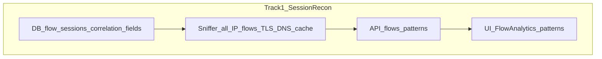
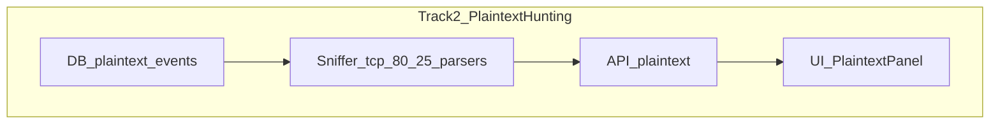

# WiSpy — TA Feedback Extension Plan

This document translates guidance from Doron (TA, BGU Network Security) into concrete project extensions. It complements [`plan.md`](plan.md) and [`Impl_report.md`](Impl_report.md) and should be the single backlog for TA-driven scope.

---

## TA guidance summary (Hebrew → English)

> **(1) DNS direction** — כן הכיוון נכון. DNS is how the victim reaches the world; on a rogue AP you control plain DNS, so the victim will not notice. DHCP at connection start is valuable; you catch the victim at the beginning of communication.

> **(2) HTTP vs metadata** — הייתי מקליט את כל התעבורה ורושם ל-DB. Most traffic is encrypted and will not reveal content, but **metadata** matters: who they contacted, for how long. **Usage patterns** (e.g. WhatsApp a few minutes daily vs Instagram once every two days) are meaningful even without decrypting payloads. Track all communication; log usability even when content is opaque.

> **(3) Cleartext, encrypted traces, AI** — Two classes: cleartext (HTTP, SMTP if not encrypted) and encrypted (still leaves traces of existence). An **AI agent** helps scale analysis and identify victim-specific weaknesses when there is a lot of traffic or many targets.

---

## 1. Context — student update to TA

Noam and Roee reported (April 2026):

- TP-Link NIC passthrough to Kali VM; drivers installed; **rogue twin AP** works (`airmon-ng`, `hostapd`, `dnsmasq`).
- Initial **DNS sniffer** (Scapy) captures DHCP hostname and DNS (e.g. `www.google.com`, `g.whatsapp.net` from a Pixel on AP `Rotem`).
- Planned: organized **dashboard** (DB, top domains, search, usage patterns) and an **AI agent** for attack recommendations.

Much of the original ask is **already implemented** (see §3). Remaining work is organized into three tracks below: **session reconnaissance** (HTTPS/TLS metadata + DNS correlation + flows), **plaintext hunting** (HTTP/SMTP cleartext), and **agentic completion** (unified AI module).

---

## 2. TA themes → WiSpy meaning

| TA point | Implication for WiSpy |
|----------|------------------------|
| **(1) DNS + rogue AP** | Stay DNS-centric for “where they go”; leverage controlled DHCP/DNS on the rogue segment. Use DNS to **enrich** HTTPS conclusions when SNI is missing or ambiguous. |
| **(2) Metadata over HTTP bodies** | Primary HTTPS signal = **TLS metadata** (SNI, JA3, flows)—not decrypted payloads. Correlate with DNS to label destinations. |
| **(3) Cleartext + patterns + AI** | **Must** detect and surface plaintext HTTP/SMTP in a dedicated store/UI. **Must** aggregate usage patterns. **One agentic module** with investigation vs attack-suggestion modes. |

---

## 3. Current alignment — already satisfies TA

| Capability | Status | Primary files |
|------------|--------|---------------|
| Wi-Fi scan + rogue AP (twin) | Done | [`core/scanner.py`](core/scanner.py), [`core/ap_manager.py`](core/ap_manager.py), [`main.py`](main.py) |
| DNS capture → SQLite | Done | [`core/sniffer.py`](core/sniffer.py), `dns_requests` |
| DHCP hostname + Option 55 | Done | [`core/sniffer.py`](core/sniffer.py), `devices.dhcp_params` |
| TLS ClientHello metadata (SNI, JA3) | Done (extend + correlate) | `tls_sni`, `ja3_fingerprints` |
| mDNS service names | Done | `mdns_broadcasts` |
| Dashboard (devices, DNS, telemetry, charts) | Done (extend) | [`web/frontend/`](web/frontend/) |
| AI (Gemini recommendations only) | Partial → **agentic module** | [`analysis/recommender.py`](analysis/recommender.py) today |
| Ad-DNS filter | Done | [`analysis/dns_filters.py`](analysis/dns_filters.py) |
| Flow sessions | **Not done** | — |
| Plaintext HTTP/SMTP table + UI | **Not done** | — |
| DNS ↔ HTTPS correlation | **Not done** | — |

---

## 4. Cross-cutting design decisions

### 4.1 HTTPS metadata + DNS correlation

HTTPS visibility comes from **TLS ClientHello metadata** (already captured: SNI, JA3) and from **flow sessions** (planned). Payload decryption stays out of scope.

**DNS as enrichment layer:** When a flow or TLS record only shows an IP (or SNI is absent / generic CDN), resolve intent using DNS already stored for the same `device_mac`:

| Signal | Source | Use |
|--------|--------|-----|
| SNI hostname | `tls_sni` | Primary label for `tcp/443` flows |
| Resolved name | `dns_requests` | Match `dst_ip` to recent A/AAAA answers for that MAC (time-windowed cache in sniffer or [`analysis/correlation.py`](analysis/correlation.py)) |
| CNAME chain | DNS replies | e.g. `g.whatsapp.net` → `chat.cdn.whatsapp.net` (student lab output) |
| mDNS / DHCP | `devices`, `mdns_broadcasts` | Local service context |

**Correlation rules (proposed):**

1. On each new/updated `flow_session` to `dst_ip:443`, set `dst_host = SNI` if present in window.
2. Else lookup `(device_mac, dst_ip)` in in-memory **DNS cache** (domain → IP, TTL ~5–15 min from sniffer DNS handler).
3. Persist `dst_host`, `host_source` enum: `sni` | `dns` | `unknown` on `flow_sessions`.
4. Dashboard shows linked evidence: “443 → 142.251.x.x (**www.google.com** via DNS)” vs “(**api.example.com** via SNI)”.

This satisfies: metadata from HTTPS **and** validating/enriching conclusions using DNS—not replacing DNS with HTTPS inspection.

### 4.2 Plaintext HTTP and SMTP (required)

The system **must** recognize cleartext HTTP and SMTP when they appear on the rogue segment:

- **Separate table** `plaintext_events` (not mixed with `dns_requests` or `flow_sessions`):
  - `id`, `device_mac`, `proto` (`http` | `smtp`), `timestamp`
  - `host_or_server` (HTTP `Host` header or SMTP `EHLO`/server greeting domain if parseable)
  - `method_or_command` (e.g. `GET`, `MAIL FROM`—metadata only)
  - `summary` (short safe excerpt, e.g. first line of request—**no** full body storage)
- **Sniffer:** parsers on `tcp/80` and `tcp/25`; only emit when payload is actually plaintext (not TLS-wrapped).
- **UI:** dedicated **Plaintext** panel (alongside DNS / telemetry tables)—highlight rare cleartext as high-signal rows.
- **Not in scope:** storing full email bodies, POST data, or credentials.

### 4.3 Agentic module (single package, two capabilities)

Treat **data investigation** and **next-step attack suggestions** as one **`analysis/agentic/`** module (refactor from standalone [`analysis/recommender.py`](analysis/recommender.py)), sharing:

- Gemini client config, model fallbacks, API key handling
- `build_context()` from `get_session_summary()` + patterns + correlation + plaintext flags
- Authorized-lab guardrails in every prompt

| Capability | API (proposed) | Base prompt focus |
|------------|----------------|-------------------|
| **Investigation** | `POST /api/agent/investigate` | “What happened?” — summarize telemetry, anomalies, DNS↔HTTPS links, cleartext hits, usage patterns; suggest **lab analysis** steps |
| **Attack suggestions** | `POST /api/agent/recommend` (existing `/api/recommend` alias) | “What could an attacker try next?” — victim-specific vectors from hostname, OS, domains, patterns; **educational / authorized lab only** |

**Shared context JSON** should include: devices, DNS top-N, correlated flows, TLS SNI/JA3, mDNS, `usage_patterns`, `plaintext_events` summary.

**UI:** one **Agentic** panel with two actions (“Investigate session” / “Suggest next steps”) or tabs—same loading/error state component.

**Phase 3 status:** substeps **TBA** after tracks 1–2 land; see §6.3.

---

## 5. Implementation tracks (next steps)

### Track 1 — Session reconnaissance

Goal: who talked to whom, for how long, with HTTPS metadata and DNS-backed destination labels.

| Substep | Work |
|---------|------|
| **1.1 DB** | Add `flow_sessions` (`device_mac`, `proto`, `src_ip`, `dst_ip`, `dst_port`, `dst_host`, `host_source`, `first_seen`, `last_seen`, `packet_count`, `byte_count`, `service_label`). Indexes on `(device_mac, last_seen)`, `(dst_ip)`. Extend `reset_db()`, `get_session_summary()`. |
| **1.2 Sniffer** | Widen BPF to rogue-client IP traffic; in-memory flow table + idle timeout; periodic upsert. Strengthen TLS path: always tie SNI to flow key. Maintain per-MAC **DNS→IP cache** for correlation. Optional: [`analysis/correlation.py`](analysis/correlation.py) for post-hoc joins. |
| **1.3 Backend** | `GET /api/flows`, extend `GET /api/data`; [`analysis/patterns.py`](analysis/patterns.py) for usage heuristics; expose `host_source` in JSON. |
| **1.4 UI** | `FlowAnalytics` (duration bars, top destinations); per-device usage pattern timeline; show DNS vs SNI label on flow rows. |
| **1.5 Mock / test** | [`mock_data.py`](mock_data.py) sample flows with `host_source: dns` and `sni` cases. |

**Also folds in (was P1):** usage-pattern analytics (“דפוסי שימוש”) on top of `flow_sessions`.

**Operational (when demo-ready):** wire [`POST /api/select-network`](web/app.py) → AP + auto sniffer ([`Impl_report.md`](Impl_report.md) §4.10).

---

### Track 2 — Plaintext packet hunting

Goal: detect, store, and surface rare cleartext HTTP/SMTP—not bulk HTTP monitoring.

| Substep | Work |
|---------|------|
| **2.1 DB** | New `plaintext_events` table (schema §4.2). `insert_plaintext()`, `get_plaintext()`, indexes on `(device_mac, timestamp)`. |
| **2.2 Sniffer** | Handlers for `tcp/80` (extract `Host`, method, path metadata) and `tcp/25` (banner, EHLO domain, command type). Dedup window like mDNS. Skip if bytes look like TLS. |
| **2.3 Backend** | `GET /api/plaintext` with pagination; include count/slice on `GET /api/data`; flag in session summary for agentic context. |
| **2.4 UI** | **Plaintext** panel—table of HTTP/SMTP hits, filter by device, badge “high signal” in monitoring screen. |
| **2.5 Mock / test** | Seed 1–2 plaintext rows in [`mock_data.py`](mock_data.py); unit test parser helpers if split out. |

---

### Track 3 — Agentic completion

Goal: one module, two prompts, rich context from tracks 1–2.

| Substep | Work | Status |
|---------|------|--------|
| **3.1 Refactor** | `analysis/agentic/` — `client.py`, `context.py`, `prompts/investigate.py`, `prompts/recommend.py`; migrate [`analysis/recommender.py`](analysis/recommender.py) | **TBA** |
| **3.2 Context builder** | Unified `build_agent_context()`: devices, DNS, correlated flows, patterns, plaintext summary | **TBA** (after 1.x, 2.x) |
| **3.3 API** | `POST /api/agent/investigate`, keep `/api/recommend` as alias for recommend | **TBA** |
| **3.4 UI** | Agentic panel (two actions); wire [`useRecommendations.js`](web/frontend/src/hooks/useRecommendations.js) → generic agent hook | **TBA** |
| **3.5 Prompt tuning** | Investigation vs attack-suggestion eval on mock + lab capture | **TBA** |

**Current baseline:** [`analysis/recommender.py`](analysis/recommender.py) implements **recommend only** via `get_session_summary()` (domain/SNI sets, no flows/patterns/plaintext). Track 3 extends—not replaces—that behavior.

---

## 6. Suggested execution order

1. **Track 1** — Session reconnaissance (DB → sniffer → backend → UI)  
2. **Track 2** — Plaintext hunting (can parallelize sniffer work after 1.2 BPF widen)  
3. **Track 3** — Agentic completion (blocked on 1.3+ and 2.3 for full context)  
4. **Real-mode integration** — AP + sniffer from React (can slot into 1.5)

---

## 7. Explicit non-goals

- Breaking or decrypting TLS/HTTPS (MITM, key extraction)
- Storing full packet payloads, email bodies, or POST content by default
- PCAP-in-DB as default behavior
- Unauthorized use outside lab / course scope

**In scope:** TLS **metadata**, DNS **correlation**, flow **duration/volume**, and **metadata-only** plaintext HTTP/SMTP events.

---

## 8. Success criteria (demo checklist)

**Track 1 — Session reconnaissance**

- [ ] `flow_sessions` populated with durations; `dst_host` filled via SNI and/or DNS cache (`host_source` visible)
- [ ] Dashboard: top destinations by **time connected**; usage-pattern view (frequent-short vs rare-long)
- [ ] Example: 443 flow to Google IP labeled `www.google.com` via DNS when SNI missing

**Track 2 — Plaintext hunting**

- [ ] Cleartext HTTP or SMTP on lab client → row in `plaintext_events` → **Plaintext** UI panel
- [ ] No full body storage; table separate from DNS/flows

**Track 3 — Agentic**

- [ ] Single agentic entry point; **Investigate** and **Recommend** return distinct, appropriate outputs
- [ ] Both prompts reference correlated flows and plaintext flags when present

**Integration**

- [ ] Real mode: scan → select network → AP + sniffer from UI
- [ ] Docs state no TLS decryption

---

## 9. TA Q&A traceability

| Student question | TA answer | WiSpy action |
|------------------|-----------|--------------|
| Is DNS direction right? | Yes; rogue DNS helps | **Keep** DNS; **correlate** with HTTPS/flows (§4.1) |
| Should we add HTTP? | Encrypted dominates; log metadata + cleartext when present | **Track 1** HTTPS metadata; **Track 2** plaintext HTTP/SMTP table + UI |
| What are we missing? | Metadata, patterns, AI | **Track 1** flows/patterns; **Track 3** unified agentic |
| Dashboard + AI | Encouraged | **Track 3** investigation + recommend capabilities |

---

## 10. File touch list

| Track | Files to create or modify |
|-------|---------------------------|
| **1** | [`analysis/storage.py`](analysis/storage.py), `analysis/correlation.py`, `analysis/patterns.py`, [`core/sniffer.py`](core/sniffer.py), [`web/app.py`](web/app.py), `web/frontend` FlowAnalytics + hooks, [`mock_data.py`](mock_data.py) |
| **2** | [`analysis/storage.py`](analysis/storage.py), [`core/sniffer.py`](core/sniffer.py), [`web/app.py`](web/app.py), Plaintext panel component |
| **3** | `analysis/agentic/*`, [`analysis/recommender.py`](analysis/recommender.py) (thin shim), [`web/app.py`](web/app.py), Agentic UI, [`useRecommendations.js`](web/frontend/src/hooks/useRecommendations.js) |

---

## 11. Reference — sample lab output (student attachment)

Scan → mimic `Rotem` → Pixel `Pixel-9a` → DNS `www.google.com`, `g.whatsapp.net`. Validates Track 1 DNS cache + Track 2/3 context; extensions build on this capture path.

---

*Last updated: May 2026 — TA thread with Doron; enhanced with DNS↔HTTPS correlation, plaintext HTTP/SMTP, unified agentic module, three-track roadmap.*
